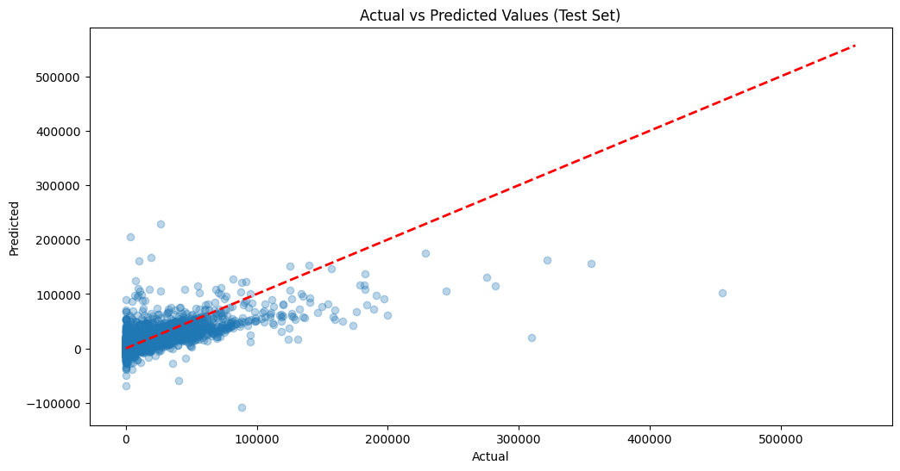
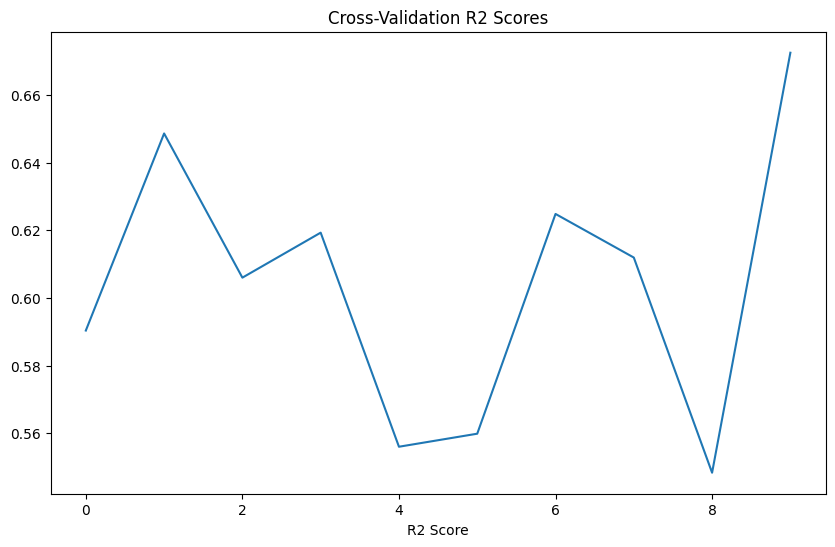
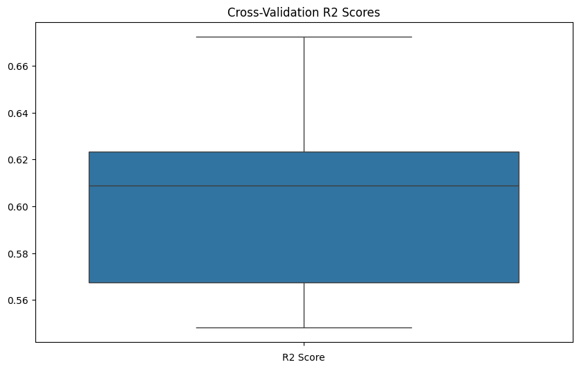
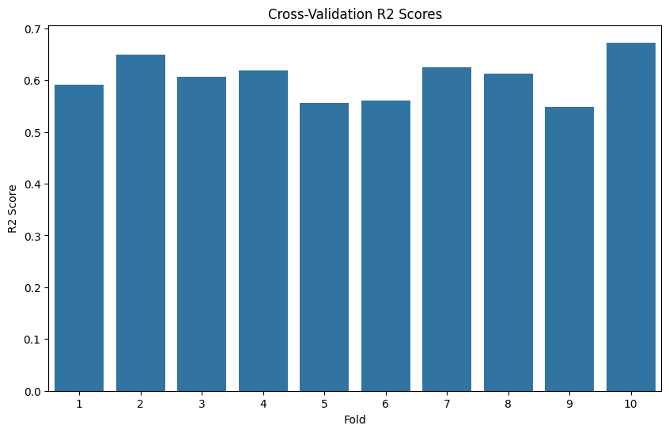
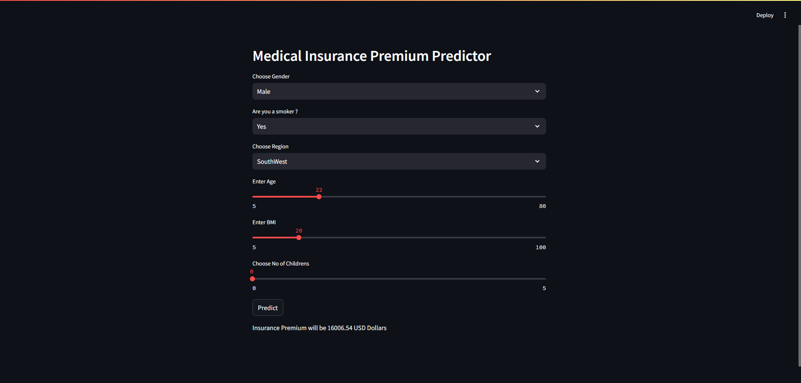

  <h1>Predicting Insurance Premiums Using Advanced Regression Techniques</h1>
    <p>This project involves predicting insurance premiums using multiple advanced regression techniques. The project includes data preprocessing, exploratory data analysis, model building, evaluation, and deployment using Flask. The goal is to provide an accurate prediction of insurance premiums based on various factors.</p>
    <h2>Dataset</h2>
    <p>The dataset used in this project can be found <a href="https://www.kaggle.com/datasets/moneystore/agencyperformance">here</a>.</p>
    <h2>Project Structure</h2>
    <ul>
        <li><code>Predicting Insurance Premiums Using Advanced Regression Techniques.ipynb</code>: Jupyter Notebook containing all the steps from data preprocessing to model evaluation.</li>
        <li><code>app.py</code>: Flask application to deploy the trained model as a web service.</li>
        <li><code>model.pkl</code>: Serialized trained model.</li>
    </ul>
    <h2>Requirements</h2>
    <p>To run the notebook and Flask application, you need to install the following packages:</p>
    <pre><code>pip install numpy pandas matplotlib seaborn scikit-learn Flask joblib</code></pre>
    <h2>Data Preprocessing and Exploratory Data Analysis</h2>
    <h3>Class Imbalance</h3>
    <p>The dataset is checked for class imbalance, and appropriate measures are taken to handle it.</p>
    <h3>Null Values</h3>
    <p>Null values in the dataset are identified and handled appropriately.</p>
    <h3>Categorical Encoding</h3>
    <p>Categorical variables are converted into numeric values for further analysis and modeling.</p>
    <h3>Correlation Analysis</h3>
    <p>A correlation matrix is generated to identify the relationships between different variables.</p>
    <h3>Visualizations</h3>
    <ul>
        <li>State-wise Distribution of Written Premiums</li>
        <li>Retention Policies VS Written Premium</li>
        <li>Additional visualizations for deeper insights into the data</li>
    </ul>
    <h2>Model Building</h2>
    <p>Several regression models are built and evaluated, including:</p>
    <ul>
        <li>Linear Regression</li>
        <li>Ridge Regression</li>
        <li>Lasso Regression</li>
        <li>ElasticNet Regression</li>
    </ul>
    <h3>Model Evaluation</h3>
    <p>The models are evaluated using metrics such as Mean Absolute Error (MAE), Mean Squared Error (MSE), Root Mean Squared Error (RMSE), and R² score.</p>
    
    <h3>Cross Validation</h3>
    <li>
      <ul><p>Cross-Validation R2 Scores - Linear plot</p>
      </ul>
      <ul><p>Cross-Validation R2 Scores - Box plot</p>
      </ul>
      <ul><p>Cross-Validation R2 Scores - Histogram plot</p>
      </ul>
    </li>
    <p><pre><code>Cross-Validation R2 Scores: [0.59036583 0.64863765 0.60600779 0.61931094 0.55601499 0.55986759
 0.62484532 0.61195018 0.54833147 0.67251033]
Mean Cross-Validation R2 Score: 0.6037842088000064</code></pre></p>

#  Medical Insurance Premium Prediction - Deployment

This repository predicts medical insurance premiums using a machine learning model and deploys an interactive web application using Streamlit.

## How to Run
1. Clone the repository:
    ```bash
    git clone https://github.com/safwannasir49/MedicalInsurancepremium.git
    cd MedicalInsurancepremium
    ```
2. Install dependencies:
    ```bash
    pip install -r requirements.txt
    ```
3. Run the application:
    ```bash
    streamlit run app.py
    ```

## Files
- **`app.py`**: Main application script for Streamlit.
- **`MIPML.pkl`**: Pre-trained model file.
- **`Medical_Insurance_Premium_Prediction.ipynb`**: Jupyter Notebook for model training and EDA.
- **`requirements.txt`**: List of dependencies.
---
  <br>
    <h2>Output</h2>
    <p align="left">
  
</p>
    <h2>Conclusion</h2>
    <p>The project successfully predicts insurance premiums using advanced regression techniques. The deployed model can be accessed via a REST API for real-time predictions.</p>
    <h2>Future Work</h2>
    <ul>
        <li>Further tuning of hyperparameters for improved model performance.</li>
        <li>Implementing additional machine learning techniques like Gradient Boosting and XGBoost.</li>
        <li>Deploying the model to a cloud platform like AWS, Google Cloud, or Heroku for scalability and robustness.</li>
    </ul>
    <h2>Repository</h2>
    <p><a href="https://github.com/safwannasir49/MedicalInsurancepremium/tree/main/Predicting%20Insurance%20Premiums%20Using%20Advanced%20Regression%20Techniques">GitHub Repository</a></p>
    <p>Feel free to clone this repository and experiment with the code. Contributions and suggestions are welcome!</p>
</body>
</html>

